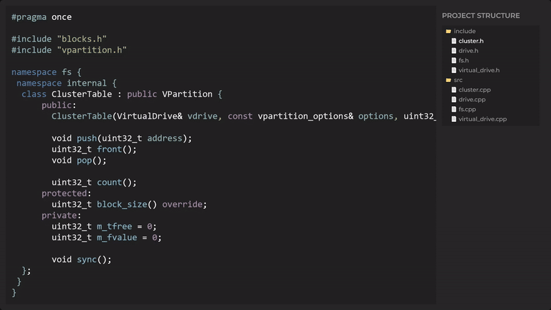
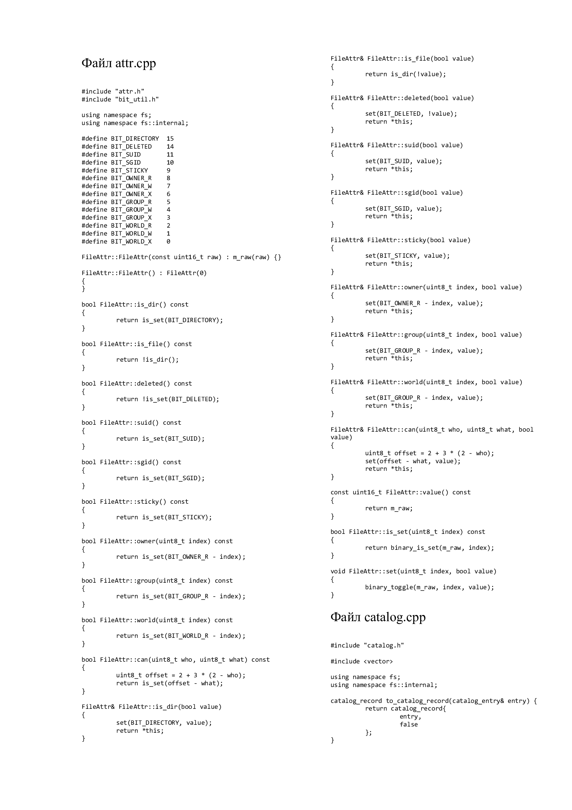

<p align="center">
   <a href="https://github.com/StarPandaBeg/docx-code-walker">
    
   </a>

   <h3 align="center">CodeWalker - Docx-генератор</h3>

   <p align="center">
      Инструмент для записи содержимого файлов в Word-документы
   </p>
</p>

---



> 😉 Устал копировать большой проект вручную?

CodeWalker - это инструмент командной строки, который поможет тебе сформировать `.docx` файл из множества различных текстовых файлов.

Ты можешь применить его для своих лабораторных, курсовых и других работ, где тебе нужно приложить листинг программного кода большого проекта, ведь копировать каждый файл вручную **так утомительно**!


Результат работы программы

## Установка

1. Убедись что у тебя в системе установлен Python 3.10 или новее! Если нет - скачать можешь [по ссылке](https://www.python.org/downloads/release/python-31011/).

   ```bash
   $ python -V
   Python 3.10.11
   ```

2. Установи `pipx` в качестве глобальной зависимости. Подробнее о `pipx` можно почитать [тут](https://pipx.pypa.io/stable/).

   ```bash
   $ py -m pip install --user pipx
   ```

   Примечание: скорее всего, после этой команды будет выведено предупреждение вроде этого:

   > WARNING: The script pipx.exe is installed in `<USER folder>\AppData\Roaming\Python\Python3x\Scripts` which is not on PATH

   Даже если оно выведено не было, рекомендуется зайти в указанную папку и выполнить следующую команду:

   ```bash
   $ pipx ensurepath
   ```

3. Добавь инструмент в свою систему

   ```bash
   $ pipx install git+https://github.com/StarPandaBeg/docx-code-walker.git
   ```

Всё готово, теперь ты можешь использовать эту программу!

## Как использовать

В командной строке введи `todocx --help`, на экране должна появиться справка об использовании программы.

### Примеры

1. Пусть есть `C++` проект, состоящий из папок _include_ и _src_. Нужно сделать листинг всех файлов в этом проекте в Word. Используй следующую команду:

   ```bash
   $ todocx project/include project/src
   ```

   Итоговый файл будет создан в текущей папке с именем `output.docx`

2. Проект состоит из папки и нескольких файлов вне её. Нужно добавить их все, причём имя папки сохранять не нужно.

   ```bash
   $ todocx --only-name project/folder1 project/file1.txt project/file2.txt
   ```

3. Проект получился слишком большим, поэтому уменьшим шрифт до 5pt и разместим текст в три колонки.

   ```bash
   $ todocx -с 3 --font Consolas 5 project
   ```

## Игнорирование файлов

Если у тебя в проекте есть файлы, которые не хочется включать в итоговый листинг, ты можешь настроить их игнорирование.

Приложение использует тот же синтаксис, как и `.gitignore` файл. Ты можешь создать в папке проекта файл `.gitignore` и он автоматически будет считан при генерации.

## P.S. Сделано StarPanda с ❤
